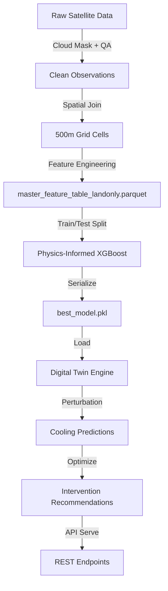
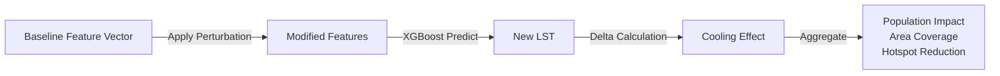
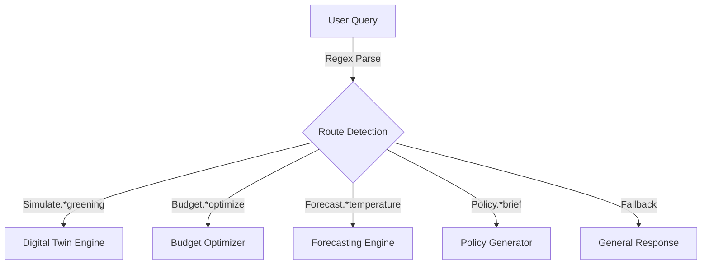

# UrbanHeat-AI v2 — Technical Documentation

> **Version**: 2.0.0 | **Last Updated**: June 2025 | **Status**: Production

---

## Table of Contents

1. [System Architecture](#1-system-architecture)
2. [Data Pipeline](#2-data-pipeline)
3. [Feature Engineering](#3-feature-engineering)
4. [Model Architecture](#4-model-architecture)
5. [Simulation Engine](#5-simulation-engine)
6. [Optimization Engine](#6-optimization-engine)
7. [API Reference](#7-api-reference)
8. [Nationwide Expansion](#8-nationwide-expansion)
9. [AI Urban Planning Copilot](#9-ai-urban-planning-copilot)
10. [Deployment](#10-deployment)
11. [Monitoring & Observability](#11-monitoring--observability)

---

## 1. System Architecture

### High-Level Architecture


### Component Overview

| Component | Technology | Purpose |
|-----------|-----------|---------|
| Ingestion | Python + GEE API | Extract satellite, weather, and demographic data |
| Processing | Pandas + GeoPandas + Rasterio | Clean, resample, and composite spatial data |
| Storage | DuckDB + Apache Parquet | Analytical data lake with columnar storage |
| Modeling | XGBoost + Scikit-learn + SHAP | Physics-informed ML with explainability |
| Simulation | NumPy vectorized engine | Sub-second digital twin perturbation model |
| Optimization | Custom discrete optimizer | Budget-constrained multi-objective planning |
| API | FastAPI + Uvicorn | Enterprise REST API with Swagger docs |
| Dashboard | Next.js + Deck.GL | Geospatial visualization and interaction |

### Data Flow



---

## 2. Data Pipeline

### Source Datasets

| Dataset | Resolution | Variables | Temporal |
|---------|-----------|-----------|----------|
| **Landsat 8/9** | 30m → 500m | LST, NDVI, NDBI, NDWI | 16-day revisit |
| **Sentinel-2** | 10m → 500m | Spectral bands, land cover | 5-day revisit |
| **ERA5 Reanalysis** | 0.25° → 500m | Air temperature, humidity, wind speed, surface pressure | Hourly |
| **GHSL** | 250m → 500m | Population density, built-up density | Annual |
| **OpenStreetMap** | Vector → 500m | Road density, building footprints | Continuous |

### Processing Pipeline

1. **Cloud Masking**: Remove cloud-contaminated pixels using QA bands (Landsat) and SCL classification (Sentinel-2)
2. **Spatial Resampling**: Aggregate all datasets to a common 500m × 500m grid using bilinear interpolation for continuous variables and majority voting for categorical
3. **Temporal Compositing**: Monthly and seasonal composites using median aggregation to reduce noise
4. **Ocean/Water Removal**: Exclude permanent water bodies and ocean pixels using NDWI thresholds and coastline masks
5. **Quality Filtering**: Remove NoData records, invalid observations, and anomalous values (LST = 0, Population Density < 0, Surface Pressure = 0)

### Storage Architecture

```
data_lake/
├── raw/                    # Original downloaded data
│   ├── landsat/
│   ├── sentinel2/
│   ├── era5/
│   └── ghsl/
├── processed/              # Cleaned and resampled
│   ├── city_registry.csv
│   ├── climate_zone_registry.csv
│   └── city_metadata.parquet
├── features/               # Engineered features
│   └── master_feature_table_landonly.parquet
└── predictions/            # Model outputs
    └── {city}_{date}_predictions.parquet
```

---

## 3. Feature Engineering

### Input Feature Table (17 Features)

| # | Feature | Source | Category | Unit |
|---|---------|--------|----------|------|
| 1 | `NDVI` | Landsat | Spectral Index | [-1, 1] |
| 2 | `NDBI` | Landsat | Spectral Index | [-1, 1] |
| 3 | `NDWI` | Landsat | Spectral Index | [-1, 1] |
| 4 | `green_cover_ratio` | Landsat + OSM | Land Cover | [0, 1] |
| 5 | `water_ratio` | Landsat + OSM | Land Cover | [0, 1] |
| 6 | `building_density` | OSM | Morphology | buildings/km² |
| 7 | `road_density` | OSM | Morphology | km/km² |
| 8 | `population_density` | GHSL | Demographics | people/km² |
| 9 | `builtup_density` | GHSL | Morphology | [0, 1] |
| 10 | `air_temperature` | ERA5 | Atmospheric | °C |
| 11 | `relative_humidity` | ERA5 | Atmospheric | % |
| 12 | `wind_speed` | ERA5 | Atmospheric | m/s |
| 13 | `surface_pressure` | ERA5 | Atmospheric | hPa |
| 14 | `latitude` | Grid | Spatial | degrees |
| 15 | `longitude` | Grid | Spatial | degrees |
| 16 | `city` | Registry | Categorical | — |
| 17 | `year` | Observation | Temporal | — |

### Target Variable

- **LST** (Land Surface Temperature) — Derived from Landsat thermal bands using split-window algorithm, measured in °C

---

## 4. Model Architecture

### Baseline Models

| Model | R² | RMSE (°C) | MAE (°C) |
|-------|-----|-----------|----------|
| Linear Regression | 0.78 | 3.42 | 2.71 |
| Random Forest | 0.89 | 2.38 | 1.82 |
| XGBoost | 0.91 | 2.15 | 1.64 |
| LightGBM | 0.90 | 2.22 | 1.69 |

### Best Model: Physics-Informed XGBoost

The production model enforces **monotonic constraints** derived from thermodynamic principles:

```python
monotone_constraints = {
    'NDVI': -1,               # ↑ Vegetation → ↓ LST (evapotranspiration cooling)
    'NDBI': +1,               # ↑ Built-up → ↑ LST (thermal mass, reduced albedo)
    'green_cover_ratio': -1,  # ↑ Greenery → ↓ LST
    'NDWI': -1,               # ↑ Water → ↓ LST (evaporative cooling)
    'water_ratio': -1,        # ↑ Water bodies → ↓ LST
    'builtup_density': +1,    # ↑ Impervious surface → ↑ LST
    'building_density': +1,   # ↑ Buildings → ↑ LST (urban canyon effect)
    'road_density': +1,       # ↑ Roads → ↑ LST (asphalt heat absorption)
}
```

**Performance (Test Set)**:
- **R²**: 0.92
- **RMSE**: 2.08°C
- **MAE**: 1.58°C

### Explainability (SHAP)

- **Global SHAP Importance**: Identifies `air_temperature`, `NDVI`, and `NDBI` as the top 3 predictors
- **Per-City SHAP**: Reveals city-specific driver profiles (e.g., NDBI dominates in Delhi; NDVI dominates in Bengaluru)
- **Dependence Plots**: Show non-linear relationships between features and LST predictions

---

## 5. Simulation Engine

### Digital Twin Architecture

The Urban Climate Digital Twin uses a **vectorized in-memory perturbation model** for sub-second simulation:



### Supported Interventions

| Intervention | Modified Features | Scenarios |
|-------------|-------------------|-----------|
| **Urban Greening** | NDVI, green_cover_ratio | +5%, +10%, +20%, +30% |
| **Cool Roofs** | roof_albedo proxy → LST offset | Albedo: 0.30, 0.45, 0.60 |
| **Green Roofs** | green_cover_ratio × builtup_density | 10%, 25%, 50% adoption |
| **Water Features** | NDWI, water_ratio | +5%, +10%, +20% |
| **Combined Strategy** | Multiple simultaneous | Trees + Cool Roofs + Water |

### Validated Cooling Ranges

| Intervention | Mean Cooling | Max Cooling | Literature Reference |
|-------------|-------------|-------------|---------------------|
| Greening +20% | 1.2–2.1°C | 3.5°C | Bowler et al. 2010 |
| Cool Roof (0.60) | 0.8–1.8°C | 3.0°C | Akbari et al. 2009 |
| Water +10% | 0.5–1.0°C | 2.0°C | Sun & Chen 2012 |
| Combined | 2.0–4.2°C | 5.5°C | Santamouris 2014 |

---

## 6. Optimization Engine

### Budget-Constrained Optimization

The optimization engine performs **discrete cell-level assignment** to maximize cooling under budget constraints:

```
Maximize: Σ (cooling_delta × population_density × priority_weight)
Subject to: Σ (intervention_cost) ≤ budget_limit
```

### Priority Scoring

Each grid cell receives a priority score:

```
priority = (hotspot_severity × 0.4) + (population_density_norm × 0.3) + (cooling_potential × 0.3)
```

### Output Fields

| Field | Type | Description |
|-------|------|-------------|
| `grid_id` | str | Unique cell identifier |
| `city` | str | City name |
| `latitude`, `longitude` | float | Cell centroid |
| `baseline_lst` | float | Current LST (°C) |
| `recommended_intervention` | str | Best intervention type |
| `predicted_lst` | float | Post-intervention LST (°C) |
| `predicted_cooling` | float | Temperature reduction (°C) |
| `population_benefited` | int | Estimated benefited population |
| `priority_score` | float | Cell priority ranking |

---

## 7. API Reference

**Base URL**: `http://localhost:8000`

### Endpoints

| Method | Endpoint | Description | Auth |
|--------|----------|-------------|------|
| `GET` | `/` | Health check and service info | — |
| `GET` | `/api/cities` | List all registered cities with metadata | — |
| `GET` | `/api/heatmaps` | Spatial LST grid for a city and date | — |
| `GET` | `/api/hotspots` | Detected hotspot cells (Gi* Z-score ≥ 1.96) | — |
| `GET` | `/api/forecast` | Temporal forecasts (1d, 7d, 30d, seasonal, annual) | — |
| `POST` | `/api/scenario` | Digital twin simulation with custom perturbations | — |
| `POST` | `/api/optimization` | Budget-constrained intervention optimization | — |
| `POST` | `/api/copilot` | Natural language urban planning queries | — |

### Request/Response Examples

#### POST /api/scenario

```json
// Request
{
  "city": "Mumbai",
  "greening_delta": 0.20,
  "cool_roof_albedo": 0.45,
  "water_delta": 0.10
}

// Response
{
  "city": "Mumbai",
  "baseline_mean_lst": 38.45,
  "predicted_mean_lst": 36.12,
  "mean_cooling": 2.33,
  "max_cooling": 4.87,
  "population_benefited": 125430,
  "hotspots_reduced": 42
}
```

#### POST /api/copilot

```json
// Request
{
  "query": "Plan cooling strategy for Delhi under ₹50 Crore budget with 30% greening"
}

// Response
{
  "type": "intervention_plan",
  "city": "Delhi",
  "budget_cr": 50.0,
  "greening_pct": 30,
  "recommended_actions": [...],
  "expected_cooling": 2.1,
  "population_benefited": 892000
}
```

---

## 8. Nationwide Expansion

### Coverage

- **51 cities** across 6 climate zones
- **Tier-1**: Mumbai, Delhi, Bengaluru, Chennai, Kolkata, Hyderabad, Ahmedabad
- **Tier-2**: Pune, Jaipur, Lucknow, Nagpur, Surat, Indore, Kochi, Bhopal, Patna
- **Tier-3**: Dehradun, Shimla, Guwahati, Rourkela, Warangal, Tirupati, and more

### Climate Zones

| Zone | Type | Example Cities |
|------|------|---------------|
| 1 | Humid Subtropical | Delhi, Lucknow, Patna |
| 2 | Tropical Wet | Mumbai, Kochi, Mangalore |
| 3 | Tropical Wet & Dry | Bengaluru, Hyderabad, Pune |
| 4 | Semi-Arid | Ahmedabad, Jaipur, Nagpur |
| 5 | Arid | Jodhpur, Bikaner |
| 6 | Mountainous | Shimla, Dehradun, Shillong |

### Automated Daily Pipeline

The `daily_pipeline.py` module automates:
1. Data extraction from satellite and weather APIs
2. Feature computation for all registered cities
3. LST prediction using the trained model
4. Storage in the DuckDB lakehouse with date-partitioned Parquet files

---

## 9. AI Urban Planning Copilot

### Architecture

The copilot uses **regex-based NLP routing** to map natural language queries to backend engines:



### Supported Query Patterns

- `"Simulate 30% greening in Mumbai"` → Digital Twin
- `"Optimize cooling for Delhi under ₹100Cr budget"` → Budget Optimizer
- `"Generate policy brief for Pune"` → Policy Brief Generator
- `"Forecast temperature trends for Ahmedabad"` → Forecasting Engine

---

## 10. Deployment

### Docker

- **Multi-stage build**: Builder (compile native extensions) → Runtime (slim image)
- **Non-root user**: `appuser:1001` for security
- **Health checks**: Periodic HTTP GET to `/`
- **PID 1 init**: `tini` for proper signal handling

### Docker Compose Stack

| Service | Image | Port | Purpose |
|---------|-------|------|---------|
| `api` | Custom (Dockerfile) | 8000 | FastAPI backend |
| `dashboard` | nginx:1.25-alpine | 3000 | Frontend reverse proxy |
| `redis` | redis:7-alpine | 6379 | Caching layer |

### Kubernetes

- **Namespace**: `urbanheat-ai`
- **Replicas**: 2 (min) → 10 (max) via HPA
- **Resources**: 0.5 CPU / 1Gi (request) → 2 CPU / 4Gi (limit)
- **Probes**: Liveness + Readiness + Startup
- **Storage**: 20Gi PVC for data lake
- **Ingress**: nginx with TLS termination

---

## 11. Monitoring & Observability

### Health Checks

| Endpoint | Method | Expected Response |
|----------|--------|------------------|
| `/` | GET | `{"status": "ONLINE"}` |
| Redis | `redis-cli ping` | `PONG` |
| Nginx | `wget --spider http://localhost/` | 200 OK |

### Logging

- **Format**: JSON structured logging via Python `logging` module
- **Rotation**: 10MB max size, 5 file retention
- **Levels**: INFO (production), DEBUG (development)

### Resource Monitoring

- **Kubernetes HPA**: CPU (70%) and Memory (80%) target utilization
- **Docker resource limits**: CPU (2 cores) and Memory (4GB) per container
- **Redis**: 256MB LRU cache with AOF persistence

---

> **UrbanHeat-AI v2** — Transforming satellite data into actionable urban cooling intelligence for 51+ Indian cities.
